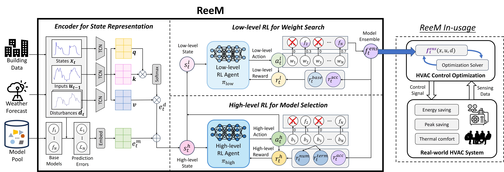

## ReeM: Hierarchical Reinforcement Learning Empowers Dynamic Model Ensemble for HVAC Model Predictive Control

-------------------

- [Installations](#installations)
- [Repository Structure](#repository-structure)
- [Introduction](#introduction)

-------------------

## Installations

### Step 1. Clone the repository:
```bash
$ git clone https://github.com/liuyaohui301/reem-release
$ cd reem-release
```

### Step 2. Set up the environment:
```bash
# Set up the environment
conda create -n mlomics python=3.13
conda activate 
```

### Step 3. Install requirements:
```bash
pip install -r requirements.txt
```

### Step 4. Download datasets:
```
# the dataset already downloaded at directory /data/raw/osaka/2024/{#room_id}.csv
```


## Repository Structure
```
reem-release/
├── config                           # Project parameters configuration
├── data/                            # Dataset
│   └── raw/
│       ├── osaka/   
│       │   ├── 2024/                
├── data_provider/                   # Dataloader
├── exp/                             # Model training (.py files)
├── layers/                          # Feature representation module (.py files)
├── models/                          # Model structures (.py files)
│   ├── pool/                        # Pretrained model pool
├── pic/                             # Paper figures
└── utils/                           # Logging module
```

## Introduction

Model Predictive Control (**MPC**) has emerging as a highly effective strategy for Optimizing Heating, Ventilation, and Air Conditioning (**HVAC**) systems. MPC's performance heavily relies on accurate building thermodynamics models, which traditionally suffer from costly  development and limited adaptability factors.


*Figure: The illustration of MPC-based HVAC control optimization process, and how the accuracy of the thermodynamics model influences the optimization result.*

The goal of this work is to show that the effectiveness and efficiency of thermodynamics modeling can be greatly enhanced using Reinforcement Learning (**RL**).

To this end, we propose a novel Hierarchical Reinforcement Learning (HRL)-based framework, `ReeM`, that learns dynamic model ensemble policy. `ReeM` intelligently selects the most suitable models from a pre-prepared pool and assigns optimal weights for real-time thermal dynamics prediction within each MPC optimization horizon. This process solely from the observed data stream without requiring explicit knowledge of the underlying physics in this domain.


*Figure: ReeM implementation and in-usage.*

Specifically, `ReeM` formulates the ensemble task as a two-level decision-making process: the high-level agent determines whether a model should be included in the ensemble; the low-level agent assigns weights to each selected model. Additionally, a data representation module extracts features from observed system states to enable effective actions by the agents.

Our on-site experiments confirm that `ReeM` can achieve 47.5\% improvement in modeling prediction accuracy, and a significant 8.7\% energy saving in real HVAC control.


*Figure: The real on-site environment at University of Osaka.*

| HVAC   | Model     | Room A Out [°C] | Room A In [°C] | Room A [kWh] | Room B Out [°C] | Room B In [°C] | Room B [kWh] |
|--------|-----------|-----------------|----------------|--------------|-----------------|----------------|--------------|
| Cooling| _Cust_-SR | 31.81           | 27.54          | 4.48         | 31.81           | 26.53          | 9.72         |
|        | **ReeM**  | 32.10           | 27.62          | **4.24**     | 32.10           | 27.43          | **9.18**     |
| Heating| _Cust_-SR | 2.53            | 20.25          | 7.38         | 2.53            | 21.34          | 11.61        |
|        | **ReeM**  | 3.71            | 20.19          | **5.96**     | 3.71            | 21.05          | **11.01**    |

*Table: Two-week A/B experiments in Jan and Jul 2025 for heating and cooling under similar outdoor temperatures.*


*Figure: The end-to-end deployment of ReeM in the Room C. 
Four specified models involved in this operational period.
The scatter with darker color and bigger size depicts the base model in ensemble with higher weight.*